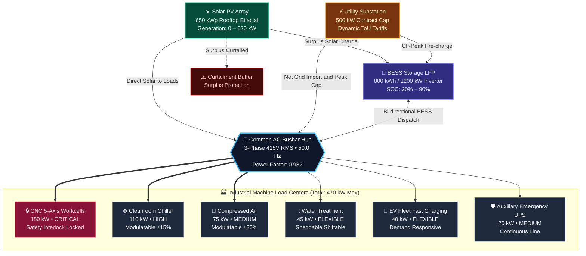
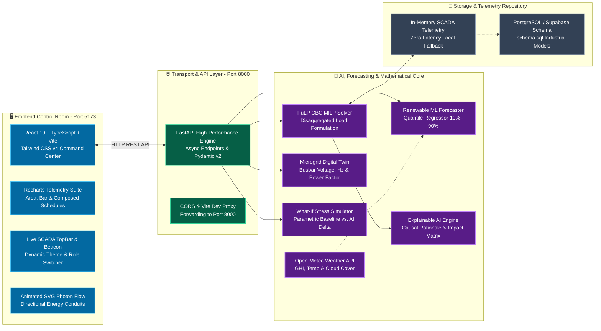

# ENERGIQ: AI-Powered Renewable Energy & Industrial Load Orchestration Platform

[](https://fastapi.tiangolo.com)
[](https://react.dev)
[](https://www.typescriptlang.org)
[](https://coin-or.github.io/pulp/)
[](https://tailwindcss.com)
[](https://opensource.org/licenses/MIT)

> **Live Localhost Deployments**:  
> 🖥️ **Frontend Control Room**: [`http://localhost:5173`](http://localhost:5173)  
> ⚙️ **Backend Optimization API**: [`http://localhost:8000`](http://localhost:8000)  
> 📑 **Interactive Swagger Docs**: [`http://localhost:8000/docs`](http://localhost:8000/docs)

---

## 1. Executive Overview & Problem Statement

Modern industrial manufacturing sites integrate behind-the-meter renewable generation (Solar PV, Wind), Battery Energy Storage Systems (BESS), complex Time-of-Use (ToU) grid contracts with steep demand penalties, and diverse industrial machine lines. While renewable generation is naturally intermittent and weather-dependent, industrial production lines require strict continuity, tight scheduling, and rigid output targets.

**ENERGIQ** is an AI-powered, multi-objective industrial energy orchestration platform. It models microgrid physical power flows, forecasts renewable generation variability with quantile confidence bands, evaluates ToU tariff arbitrage, tracks cyclic battery degradation, and employs formal **Mixed-Integer Linear Programming (MILP)** to compute optimal multi-period dispatch schedules while guaranteeing **100% production feasibility for critical manufacturing assets**.

---

## 2. Microgrid Topology & Energy Flow Diagram



---

## 3. End-to-End System & AI Software Architecture



---

## 4. Project Folder Structure

```text
ENERGIQ/
├── .env.example                     # Environment configuration template
├── .gitignore                       # Git exclusion rules (venv, node_modules, dist)
├── README.md                        # Master architecture, documentation, and quickstart guide
│
├── backend/                         # Python FastAPI Backend & Mathematical Optimization Core
│   ├── requirements.txt             # Python backend dependencies
│   ├── .venv/                       # Python virtual environment (CPython 3.12)
│   ├── app/                         # Application source code
│   │   ├── __init__.py
│   │   ├── main.py                  # FastAPI application entry point, CORS, and routing
│   │   │
│   │   ├── database/                # Repository & persistence layer
│   │   │   ├── repository.py        # Seed telemetry, in-memory repository, and state manager
│   │   │   └── schema.sql           # Production PostgreSQL/Supabase industrial schema
│   │   │
│   │   ├── forecast/                # Machine learning & renewable forecasting
│   │   │   ├── __init__.py
│   │   │   └── renewable_forecaster.py # Multi-horizon quantile solar forecaster (Open-Meteo)
│   │   │
│   │   ├── models/                  # Pydantic v2 domain schemas & types
│   │   │   ├── __init__.py
│   │   │   └── schemas.py           # Typed contracts (Loads, Battery, Tariffs, MILP Results)
│   │   │
│   │   └── optimization/            # Mathematical optimization solver
│   │       ├── __init__.py
│   │       └── milp_optimizer.py    # PuLP CBC disaggregated MILP dispatch engine
│   │
│   └── tests/                       # Automated API & solver test suites
│       └── test_api.py              # 14 comprehensive integration tests (100% passing)
│
├── frontend/                        # React 19 + TypeScript + Vite Industrial Web Application
│   ├── package.json                 # Node.js dependencies & build scripts
│   ├── tsconfig.json                # TypeScript root configuration
│   ├── tsconfig.app.json            # Vite frontend TypeScript compiler settings
│   ├── vite.config.ts               # Vite configuration with proxy to backend port 8000
│   ├── index.html                   # HTML entry point with Plus Jakarta Sans & JetBrains Mono
│   │
│   └── src/                         # Frontend client source code
│       ├── main.tsx                 # React application bootstrapper
│       ├── App.tsx                  # Root application workspace, navigation, and theme state
│       ├── index.css                # Tailwind CSS v4 design tokens, cyber-grid, and glow styles
│       │
│       ├── components/              # Modular industrial SCADA components
│       │   ├── alerts/              # Operational alarm management
│       │   │   └── AlertsPanel.tsx  # Severity badges, audio alarms, and operator acknowledge
│       │   │
│       │   ├── analytics/           # Historical performance auditing
│       │   │   └── AnalyticsDashboard.tsx # Empirical cost reduction, peak shaving, and MAE trends
│       │   │
│       │   ├── battery/             # BESS battery intelligence
│       │   │   └── BatteryGauge.tsx # SVG circular SOC gauge, degradation model, and 24h trajectory
│       │   │
│       │   ├── common/              # Reusable design tokens
│       │   │   └── StatusBadge.tsx  # Pulsating status badges (CRITICAL, OPTIMAL, WARNING)
│       │   │
│       │   ├── dashboard/           # Executive SCADA control center
│       │   │   ├── KpiCard.tsx      # Luminous top accent KPI tiles with 2D hover lifts
│       │   │   ├── EnergyFlowDiagram.tsx # Dynamic SVG photon conduits and routing summary
│       │   │   └── RecommendationCard.tsx # Explainable AI causal rationale & impact metrics
│       │   │
│       │   ├── digitaltwin/         # Cyber-physical microgrid mirror
│       │   │   └── DigitalTwinView.tsx # Busbar 415V RMS, 50Hz, power factor, and node telemetry
│       │   │
│       │   ├── forecast/            # Weather & solar generation preview
│       │   │   └── ForecastChart.tsx # Multi-horizon curve with 10%–90% confidence bands
│       │   │
│       │   ├── grid/                # Time-of-Use tariff intelligence
│       │   │   └── TariffChart.tsx  # Dynamic 24h ToU ladder with demand charge warnings
│       │   │
│       │   ├── layout/              # SCADA shell & layout
│       │   │   ├── TopBar.tsx       # Live digital clock, status beacon, and theme toggle
│       │   │   └── Sidebar.tsx      # Categorized navigation with glowing active indicators
│       │   │
│       │   ├── loads/               # Industrial load disaggregation matrix
│       │   │   └── LoadMatrix.tsx   # Per-machine power sliders and CRITICAL safety locks
│       │   │
│       │   ├── optimization/        # Autonomous MILP dispatch controls
│       │   │   └── OptimizationPanel.tsx # Interactive solver knobs, schedules, and numerical matrix
│       │   │
│       │   ├── settings/            # System & hardware ratings modal
│       │   │   └── SettingsModal.tsx # Plant capacity ratings, solver parameters, and roles
│       │   │
│       │   └── simulator/           # What-If parametric sandbox
│       │       └── WhatIfSimulator.tsx # Stress tests and side-by-side BEFORE vs. AFTER cards
│       │
│       ├── services/                # API communication layer
│       │   └── api.ts               # Axios client with typed REST endpoint methods
│       │
│       ├── types/                   # TypeScript interfaces & types
│       │   └── index.ts             # Data contracts matching Pydantic schemas exactly
│       │
│       └── utils/                   # Helper utilities
│           └── useCardTilt.ts       # Performance-optimized 2D hover lift interaction hooks
│
├── docs/                            # In-depth architectural & mathematical documentation
│   ├── architecture.md              # System design, data flow, and resilience guidelines
│   ├── optimization.md              # Complete MILP mathematical formulation & proofs
│   ├── ml.md                        # Quantile regression, GHI physics, and validation metrics
│   └── api.md                       # Comprehensive OpenAPI endpoint documentation
│
└── ml/                              # Machine learning training scripts and artifacts
    └── data/                        # Historical solar irradiance and load baseline datasets
```

---

## 5. Mathematical Formulation (Disaggregated MILP)

### Objective Function
The optimizer minimizes the aggregate cost of grid electricity, peak demand penalties, battery degradation, renewable curtailment, and flexibility violations over a planning horizon $T = 24$ hours ($\Delta t = 1$ hr):

$$\min \sum_{t=1}^T \left[ C^{\text{grid}}_t \cdot (p^{\text{grid2load}}_t + p^{\text{grid2bess}}_t) \Delta t + C^{\text{deg}} \cdot (p^{\text{pv2bess}}_t + p^{\text{grid2bess}}_t + p^{\text{bess2load}}_t) \Delta t + w^{\text{curt}} \cdot p^{\text{curt}}_t \Delta t + w^{\text{viol}} \sum_{i=1}^N s^{\text{viol}}_{i,t} \right] + C^{\text{peak}} \cdot p^{\text{peak}}$$

### Operational Constraints
1. **Instantaneous Hub Energy Balance**:
   $$p^{\text{pv2load}}_t + p^{\text{grid2load}}_t + p^{\text{bess2load}}_t = \sum_{i=1}^N p^{\text{load}}_{i,t} \quad \forall t \in \{1, \dots, T\}$$

2. **Renewable Allocation & Curtailment**:
   $$p^{\text{pv2load}}_t + p^{\text{pv2bess}}_t + p^{\text{curt}}_t = P^{\text{pv}}_t \quad \forall t$$

3. **Battery SOC Dynamic State Transition**:
   $$\text{SOC}_{t+1} = \text{SOC}_t + \frac{100}{E^{\text{cap}}} \left( \eta_{\text{ch}} (p^{\text{pv2bess}}_t + p^{\text{grid2bess}}_t) - \frac{1}{\eta_{\text{dis}}} p^{\text{bess2load}}_t \right) \Delta t$$
   $$\text{SOC}_{\min} \le \text{SOC}_t \le \text{SOC}_{\max}, \quad \text{SOC}_T \ge \text{SOC}_{\text{reserve}}$$

4. **Mutual Exclusivity of Battery Inverter**:
   $$u^{\text{ch}}_t + u^{\text{dis}}_t \le 1, \quad u^{\text{ch}}_t, u^{\text{dis}}_t \in \{0, 1\}$$
   $$p^{\text{pv2bess}}_t + p^{\text{grid2bess}}_t \le P^{\text{ch,max}} u^{\text{ch}}_t, \quad p^{\text{bess2load}}_t \le P^{\text{dis,max}} u^{\text{dis}}_t$$

5. **Substation Peak Demand Tracking**:
   $$p^{\text{peak}} \ge p^{\text{grid2load}}_t + p^{\text{grid2bess}}_t \quad \forall t$$
   $$p^{\text{grid2load}}_t + p^{\text{grid2bess}}_t \le P^{\text{grid,limit}} \quad \forall t$$

6. **Individual Load Satisfaction & Safety Lock**:
   $$p^{\text{load}}_{i,t} + s^{\text{viol}}_{i,t} \ge P^{\text{nominal}}_{i,t} \quad \forall i, t$$
   $$s^{\text{viol}}_{i,t} = 0 \quad \forall i \in \text{CRITICAL}, t \quad \text{(CNC lines strictly protected)}$$

---

## 6. Quickstart Guide

### Prerequisites
- **Node.js**: v18+ (tested on Node v25)
- **Python**: 3.11 or 3.12
- **Package Managers**: `uv` or `pip`, `npm`

### Step 1: Start Backend API & Optimization Solver
```bash
cd backend

# Create virtual environment
python -m venv .venv
source .venv/bin/activate       # On Windows: .venv\Scripts\activate

# Install dependencies
pip install -r requirements.txt

# Run FastAPI with live reloader
python -m uvicorn app.main:app --host 127.0.0.1 --port 8000 --reload
```
*Backend initializes at `http://127.0.0.1:8000` with Swagger UI at `/docs`.*

### Step 2: Start Frontend SCADA Control Room
```bash
cd frontend

# Install frontend packages
npm install

# Start Vite development server
npm run dev
```
*Frontend opens at `http://localhost:5173`. Vite automatically proxies all `/api/*` network requests to `http://localhost:8000`.*

### Step 3: Run Automated Test Suites
```bash
cd backend
.venv\Scripts\pytest.exe -o pythonpath=. tests/test_api.py
```
*Runs all 14 end-to-end integration tests verifying PuLP MILP solver convergence, critical safety locks, and API schemas.*

---

## 7. REST API Reference Summary

| Endpoint | Method | Description |
| :--- | :--- | :--- |
| `/health` | `GET` | System health check, solver status, and service metadata |
| `/api/dashboard/kpis` | `GET` | Real-time executive KPIs with trends and contextual badges |
| `/api/energy-flow` | `GET` | Directed numerical flows between Solar, BESS, Grid, and Factory |
| `/api/forecast/renewable` | `GET` | Weather-aware forecast curve with upper/lower uncertainty bounds |
| `/api/forecast/load` | `GET` | Production shift-based factory demand schedule |
| `/api/loads` | `GET` | Configurable industrial load matrix with ratings and priority |
| `/api/loads/{load_id}` | `PUT` | Shed or modulate flexible loads (Critical loads locked) |
| `/api/battery` | `GET` | Real-time BESS SOC, health, available energy, and 24h trajectory |
| `/api/grid` | `GET` | Time-of-Use schedule, current rate, and demand charge exposure |
| `/api/optimization/run` | `POST` | Execute PuLP MILP solver and return optimal dispatch schedule |
| `/api/simulator/run` | `POST` | Execute What-If simulation comparing Before vs After dispatch |
| `/api/digital-twin` | `GET` | Electrical busbar frequency, voltage, power factor, and nodal states |
| `/api/analytics` | `GET` | Historical savings, peak reduction, and forecast error metrics |
| `/api/alerts` | `GET` | Active system alarms and recommended operator actions |

---

## 8. Supervisory Decision-Support & Safety Boundaries

ENERGIQ functions as an **industrial decision-support and supervisory optimization platform**. To protect multimillion-dollar industrial equipment and prevent unplanned production stoppages:
1. **Human-in-the-Loop Approval**: Optimization schedules and load modulations are generated as structured recommendations requiring operator confirmation before SCADA actuation.
2. **Safety Interlocks**: Critical manufacturing lines (e.g., CNC 5-Axis machining cells) are hard-locked against automated shedding or curtailment.
3. **Battery Protection**: Minimum state-of-charge reserves (20%) are strictly bounded in the MILP model to safeguard emergency readiness.

---

## 9. License

This project is licensed under the MIT License — see the [LICENSE](LICENSE) file for details.
